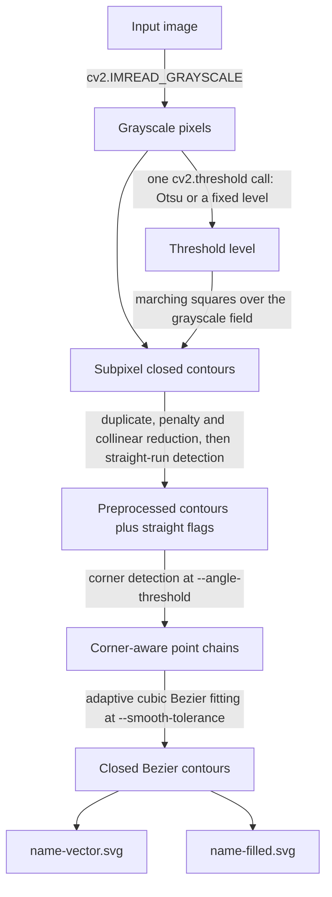

# Challenge 1: raster outline to SVG

Challenge 1 turns a dark-on-light raster image into a compact, filled SVG. It
traces the **boundary of the ink** rather than the centerline of the pen, so the
result keeps the silhouette, the separate components, and the enclosed holes of
the source.

For installation and the short command reference, see the
[project README](../README.md).

## Pipeline at a glance



Only three of these stages have knobs on the command line. Everything else is
tuned by constants in the source, listed under
[Constants worth knowing about](#constants-worth-knowing-about).

## 1. Input discovery and grayscale loading

[`cli.main`](../src/challenge_1/cli.py) accepts either one image or a directory.
A directory is searched recursively for `.png`, `.jpg`, `.jpeg`, `.bmp`, `.tif`
and `.tiff`, and its relative structure is preserved below the output directory:
`input/a/b/c.png` becomes `output/a/b/c-filled.svg`. The arguments are validated
before any file is touched — threshold within 0 to 255, angle within 0 to 180
degrees, tolerance positive and finite.

[`pipeline.process_image`](../src/challenge_1/pipeline.py) loads each image with
`cv2.IMREAD_GRAYSCALE` and raises a clear `ValueError` if OpenCV cannot decode
the file.

## 2. Threshold selection

`threshold_level(gray, threshold)` in
[raster.py](../src/challenge_1/raster.py) picks the grayscale level that
separates ink from background, and returns only that number.

With `threshold=None` the `cv2.threshold` call includes `cv2.THRESH_OTSU`, so
OpenCV chooses the level from the grayscale histogram. A `--threshold LEVEL`
value disables Otsu and supplies a fixed level instead. Values at or below the
level are ink; the pipeline assumes the subject is darker than its background.

Nothing downstream ever sees a black-and-white image. Contour tracing takes the
level together with the **original grayscale pixels**, which preserves the
subpixel edge information that binarizing would have thrown away.

## 3. Closed contour tracing

`extract_contours(gray, level)` in [contours.py](../src/challenge_1/contours.py)
runs marching squares directly over the grayscale image.

**The field.** The grayscale values are turned into a signed field and padded by
one cell of background:

```python
field = np.pad((level + 0.5) - gray_img.astype(np.float64), 1, constant_values=-1.0)
inside = field > 0
```

The `+ 0.5` makes `field > 0` agree exactly with OpenCV's integer `>` comparison,
so the traced boundary sits where the binary image's edge would be. Padding with
`-1.0` (background) guarantees that ink touching the image border still produces
a closed loop.

**The cases.** Each 2×2 cell packs its four corners into a 4-bit number — bit 0
top-left, bit 1 top-right, bit 2 bottom-right, bit 3 bottom-left. Cases 0 and 15
hold no boundary and are skipped. The twelve unambiguous cases map to a directed
edge pair in `_SEGMENTS`. Cases 5 and 10 are the diagonal saddles, where the two
ink corners touch only at a point; they are resolved from the sum of the four
field values at the cell (`_SADDLES`), which keeps the local topology consistent
with the grayscale data rather than picking arbitrarily.

**The loops.** Every case writes `following[entry_edge] = exit_edge` into a
dictionary. Closed contours then fall out by simply walking that dictionary from
each unvisited edge until an edge repeats. Loops with fewer than 4 points are
discarded as noise.

**The crossings.** `_crossing` places each vertex by linear interpolation between
the two grayscale samples that straddle the level:

```python
fraction = first / (first - second)
```

Coordinates come out in pixel-corner space — pixel `(row, column)` spans
`[column, column+1) × [row, row+1)`, so its center is at
`(column + 0.5, row + 0.5)`. That is the same convention SVG uses, so the vector
output lines up with the PNG without any extra shift.

The result is a set of closed contours whose vertices lie at fractional pixel
coordinates. Antialiased edges keep their real position instead of becoming
pixel-boundary staircases, and outer silhouettes and enclosed holes emerge as
separate loops from the same field.

## 4. Contour preprocessing

Marching squares emits one vertex per cell edge, which is far more than curve
fitting needs. `preprocess_contours` reduces that in three passes and then
identifies which parts of what's left are genuinely straight.

**`_remove_duplicated_points`** drops consecutive duplicates and the redundant
closing point.

**`_limit_penalties`** is a greedy, Potrace-style reduction. `_penalty` computes
Heron's area squared over the chord, which works out to `chord · height² / 4`, so
it punishes both how far a point bulges off the chord and how long that chord is.
Intermediate points are absorbed until the worst penalty in the current run
reaches `simplify_tolerance` (0.25), at which point a new keeper is emitted. If
the reduction would collapse the loop below three points it falls back to the
full path.

**`_remove_collinear`** iteratively drops any vertex whose cross product with its
neighbours is effectively zero, repeating until nothing more can go.

**`_straight_runs`** is what keeps flat edges dead straight instead of subtly
wobbly, and it runs in two steps.

`_breaks` scores every remaining vertex by walking `break_span` (12 px) backward
and forward along the path and summing the absolute turn it accumulates:

```python
breaks.append(total >= angle and total * span >= angle * arc)
```

Two conditions have to hold: enough total turn (`break_angle`, 30 degrees), and
that turn concentrated densely enough per unit of arc length. A gentle 30 degrees
spread over a long arc is not a break; a sharp 30 degrees over a few pixels is.
Separately, any polygon edge at least `dominant_straight` (64 px) long
force-marks both of its endpoints — an edge that long is a line by definition.

Between consecutive marks, `_runs_straight` then decides whether the span really
is a line. It has to be at least `minimum_straight` (8 px) long, bow no more than
`straight_tolerance` (1 px) off its chord, and satisfy
`length² >= 8 · bow · straight_radius` — a curvature test, since a small bow over
a long span implies a circle radius so large it may as well be a line. Straight
runs are extended greedily for as long as they stay straight. Spans that are not
straight keep all of their intermediate points, so curve fitting still has
witnesses to work against.

The function returns `(kept_indices, flags)`, where `flags[i]` says "the edge
from `kept[i]` to `kept[i+1]` is a line". `preprocess_contours` returns the
points with the first one repeated at the end, plus one flag tuple per contour.

All of this operates on the interpolated geometry. Nothing blurs or
morphologically filters the source image.

## 5. Corner detection

`smooth_contours` calls
[`challenge_1.curve_fitting.corner_flags`](../src/challenge_1/curve_fitting.py), which marks
any vertex whose direction change is at or above `--angle-threshold` (60 degrees
by default) as a corner.

A lower angle threshold preserves more direction changes as corners. A higher one
treats more of the contour as a smooth run.

## 6. Adaptive cubic Bezier fitting

`fit_closed_contour` lives in
[challenge_1/curve_fitting.py](../src/challenge_1/curve_fitting.py).

**Where the loop is cut.** `_cut_indices` cuts at every corner *and* at both ends
of every straight run. Giving a straight run its own section means it stays the
line it was measured to be, and the curves on either side start where the line
stops instead of eating into it. If that yields fewer than two cuts, an
antipodal point is added so the closed chain has sections at all. A section that
is exactly one straight edge is emitted directly by `_line_curve` as a
line-equivalent cubic — no fitting.

**Tangents come first.** `_cut_tangents` fixes the direction at every cut before
any fitting happens, and this is the main lever on output quality:

- At a **corner** the path turns, so each side is measured on its own, from a
  chord over `tangent_span` (3 px) of path. Measuring over a span rather than one
  step keeps raster quantization out of the estimate.
- Where a **straight run** meets a curve, the curve inherits the line's exact
  direction, so it leaves *along* the line rather than across it.
- At **any other cut** both sides get one centred estimate, which is what makes
  the two sections' tangents equal and their join smooth.

**The fit.** Each remaining section is densified by `_densify` at
`min(1.0, max(0.25, tolerance))` pixel spacing to give the fitter witnesses, then
`_fit_cubics` runs the classic Schneider algorithm:

1. chord-length parameterize the witnesses (`_parameters`);
2. hold the endpoint tangents fixed and solve the two control-handle lengths by
   a 2×2 least squares (`_generate_bezier`), falling back to `chord / 3` when the
   system is degenerate or the solution comes out negative;
3. measure the worst squared deviation of the fitted curve from the witnesses
   (`_fit_error`);
4. if it exceeds the tolerance, split at that worst point and recurse.

A recursive split hands the same tangent to both halves, so the resulting chain
of `BezierCurve` values is smooth everywhere except at the corners, which keep
their deliberate tangent break. Finally, the last curve's endpoint is nudged onto
the first curve's start so the loop closes exactly.

`--smooth-tolerance` is that accepted sampled error in pixels, `0.75` by default.
A lower value follows the contour more closely and produces more segments; a
higher value gives a smaller, smoother result.

## 7. Outputs

| File | Purpose |
|---|---|
| `<stem>-vector.svg` | Debug SVG: colored 1 px Bezier contours with anchor dots |
| `<stem>-filled.svg` | Final compact black-on-white filled SVG |

Both SVGs are built by [challenge_1/svg.py](../src/challenge_1/svg.py), which
keeps the path data small three ways: a cubic that is straight within
0.005 · length becomes an `L` command; consecutive collinear `L` commands in the
same direction collapse into one; and a repeated `C` command omits the letter.
Coordinates round to at most two decimals with trailing zeros stripped.

`bezier_svg` draws the debug view — white background, 1 px colored strokes, and a
dot at each Bezier anchor from `get_curve_anchors`. Its colors come from
`random_contour_colors`, which rejects anything too gray (`max - min < 64`) and
any duplicate so contours stay distinct. They change between runs and never
affect the filled output.

`filled_bezier_svg` puts **every** closed contour into one compound path with
`fill-rule="evenodd"`. Crossing each nested boundary toggles the fill, so holes
reconstruct correctly regardless of contour order or winding direction.

## Running the pipeline

Process every supported image in the default input directory:

```bash
uv run challenge_1
```

Process one image:

```bash
uv run challenge_1 \
  --input input/challenge_1/cabinet.png \
  --output output/challenge_1
```

Tune classification and fitting independently:

```bash
uv run challenge_1 \
  --threshold 128 \
  --angle-threshold 75 \
  --smooth-tolerance 1
```

| Option | Default | Effect |
|---|---:|---|
| `--input`, `-i` | `input/challenge_1` | Source image or recursive source directory |
| `--output`, `-o` | `output/challenge_1` | Root directory for generated files |
| `--threshold`, `-t` | Otsu | Fixed grayscale split from 0 to 255 |
| `--angle-threshold`, `-a` | `60` | Minimum turn, in degrees, kept as a corner |
| `--smooth-tolerance`, `-s` | `0.75` | Maximum sampled Bezier fitting error, in pixels |

## Constants worth knowing about

These are keyword defaults on `preprocess_contours` and `fit_closed_contour`,
not CLI options. They are the next thing to reach for when a particular image
misbehaves.

| Constant | Default | What it controls |
|---|---:|---|
| `simplify_tolerance` | `0.25` | Point-reduction penalty budget |
| `minimum_straight` | `8.0` | Shortest span that may be called a line |
| `straight_tolerance` | `1.0` | Allowed bow, in pixels, across a straight run |
| `straight_radius` | `100.0` | Curvature test paired with the bow |
| `break_span` | `12.0` | Arc length the turn accumulator looks over |
| `break_angle` | `30.0` | Turn, in degrees, that marks a candidate break |
| `dominant_straight` | `64.0` | Edge length that is a line by definition |
| `tangent_span` | `3.0` | Chord length used to estimate a cut's tangent |

## Code map

| Function / module | Responsibility |
|---|---|
| [`challenge_1.cli`](../src/challenge_1/cli.py) | CLI validation and recursive image discovery |
| [`challenge_1.pipeline`](../src/challenge_1/pipeline.py) | Runs the stages and determines output paths |
| [`challenge_1.raster.threshold_level`](../src/challenge_1/raster.py) | Picks the Otsu or fixed grayscale level |
| [`challenge_1.raster.random_contour_colors`](../src/challenge_1/raster.py) | Distinct debug colors for the vector preview |
| [`challenge_1.contours.extract_contours`](../src/challenge_1/contours.py) | Marching squares with interpolated grayscale crossings |
| [`challenge_1.contours.preprocess_contours`](../src/challenge_1/contours.py) | Reduces points and identifies exact straight runs |
| [`challenge_1.contours.smooth_contours`](../src/challenge_1/contours.py) | Detects corners and fits the preprocessed contours |
| [`challenge_1.contours.get_curve_anchors`](../src/challenge_1/contours.py) | Bezier endpoints for the debug dots |
| [`challenge_1.curve_fitting.corner_flags`](../src/challenge_1/curve_fitting.py) | Marks sharp turns that must remain corners |
| [`challenge_1.curve_fitting.fit_closed_contour`](../src/challenge_1/curve_fitting.py) | Adaptive cubic Bezier fitting |
| [`challenge_1.svg.bezier_svg`](../src/challenge_1/svg.py) | Colored vector debug view and anchor markers |
| [`challenge_1.svg.filled_bezier_svg`](../src/challenge_1/svg.py) | Final compound even-odd SVG |

## Scope and trade-offs

- The pipeline vectorizes outlines; it does not infer pen centerlines or stroke
  widths.
- The input needs a reasonably separable dark subject on a light background.
  Uneven lighting or light-colored ink needs preprocessing or a manually chosen
  `--threshold`.
- At an ambiguous diagonal contact, marching squares decides from the grayscale
  field at the cell center. Small intensity changes around the selected level can
  therefore flip whether two local loops join.
- There is no speckle removal. Small isolated foreground components become their
  own SVG contours, so noisy scans should be cleaned before vectorization.
- `_limit_penalties` compares every intermediate point in the current run, so
  very long contours on large images are the slowest part of the pipeline.
