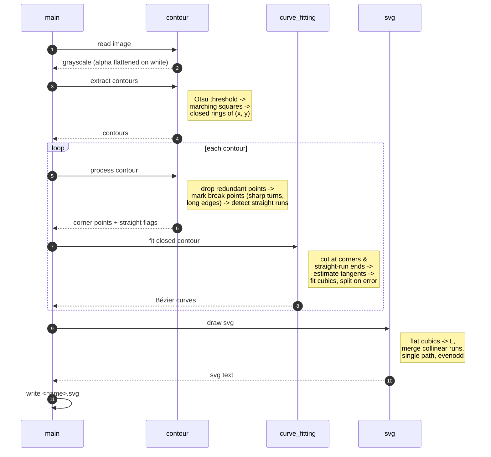

# Challenge 1: Raster outline to SVG

Each image goes through these processing stages:

1. **Binarize and trace contours**: Use Otsu threshold to pick the ink/paper cutoff, then marching squares
   walks the boundary at sub-pixel precision. Outputs are closed contours of points.
2. **Simplify contours**: drop every point that sits close enough to the chord replacing
   it (potrace/RDP-like style). Thousands of points become a polygon of dozens.
3. **Find the structure**: locate where the shape actually turns a corner, and
   which stretches are genuinely straight lines. Straight runs get collapsed into
   a single segment; corners become cut points where curves are not allowed to
   bend through.
4. **Fit curves**: between cuts, fit a cubic Bézier to the points. When the error is
   too large, split at the worst point and fit both halves, recursing until it fits.
   Tangents at the cuts are shared, so neighbouring curves join smoothly.

The contour processing and curve fitting stages live in `common.vectorization`.
Challenge 1 supplies closed boundary contours; challenge 2 uses the same code for
open and closed skeleton contours.

Then write the whole thing as one `<path>` with `fill-rule="evenodd"`, so holes
(inner rings) punch through outer rings for free.

Everything that could be a "distance in pixels" is instead a **ratio of the
contour's perimeter**, with a floor. That way a tiny glyph and a huge poster get
simplified with the same aggressiveness.

## Pipeline

## Knobs

All tunable from the CLI (`uv run challenge_1 --help`). The ones worth touching:

- `--simplify-ratio`: how much of the staircase to throw away.
- `--break-angle-threshold` / `--break-span-ratio`: what counts as a corner.
- `--straight-*`: how forgiving "this is a straight line" is.
- `--fit-ratio`: how close a curve must hug the contour before we stop
  splitting. Smaller means more curves, bigger file, more faithful.
- `-d/--debug`: per-stage timings and point counts.
