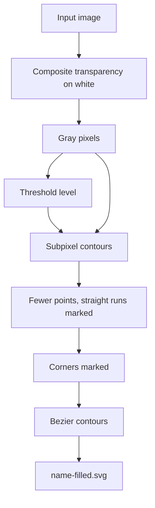

# Challenge 1

The main idea is to trace contours, smooth them by Bezier curves, then use `fill-rule="evenodd"` to paint color to the final result.

## Pipeline



Ideas do most of the work:

- **Composite transparency before tracing.** Transparent inputs are placed on
  white before grayscale conversion, so an RGBA image whose drawing is stored
  in its alpha channel does not become a solid-black canvas.
- **Trace the grayscale, not the binary.** The threshold picks a level; the
  contours are then interpolated through the original gray pixels at that level
  by `skimage.measure.find_contours`, which implements marching squares.
  Antialiased edges keep their real position instead of becoming pixel
  staircases.
- **Decide what is straight before fitting anything.** Flat spans are found and
  measured up front, so they stay exact lines and the curves beside them start
  where the line stops.
- **Fix the tangents before fitting anything.** Corners get one direction per
  side; everywhere else both sides share one estimate, which is what makes the
  joins smooth. Curves are then fitted to that, splitting until they land within
  tolerance.

The final SVG is one compound path with `fill-rule="evenodd"` to fill black color to objects.

## Run

```bash
uv run challenge_1
uv run challenge_1 -i input/challenge_1/cabinet.png -o output/challenge_1
```

| Option | Default | Effect |
|---|---:|---|
| `--input`, `-i` | `input/challenge_1` | Image or directory to process |
| `--output`, `-o` | `output/challenge_1` | Where results go |
| `--threshold`, `-t` | Otsu | Fixed split from 0 to 255 |
| `--angle-threshold`, `-a` | `60` | Minimum turn, in degrees, kept as a corner |
| `--smooth-tolerance`, `-s` | `0.75` | Maximum Bezier fitting error, in pixels |
